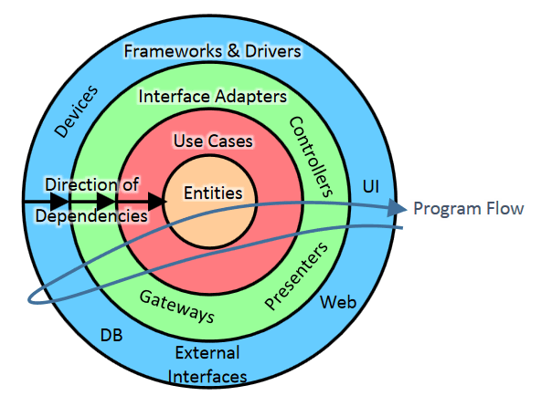

# DDD architecture in Node.js




## Loading libraries:
```
npm run build
```

## Start the server:
```
npm start
```

## Swagger API:
```
http://127.0.0.1:3000/documentation
```

## jsdoc:
```
jsdoc -r server
```